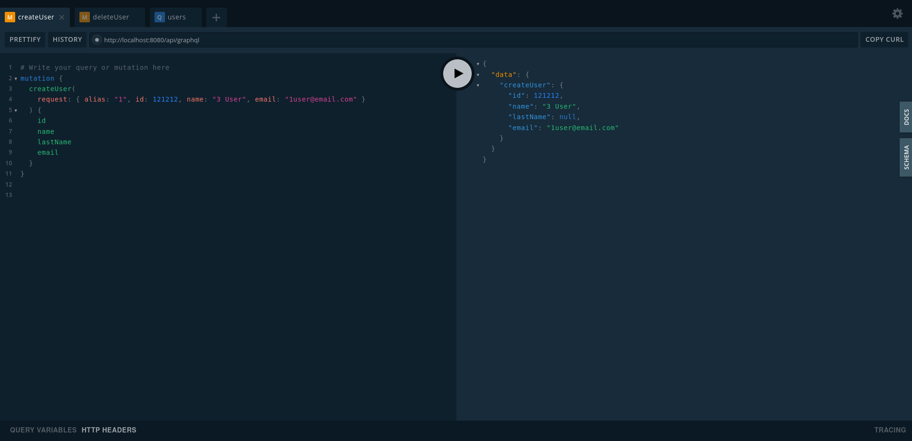
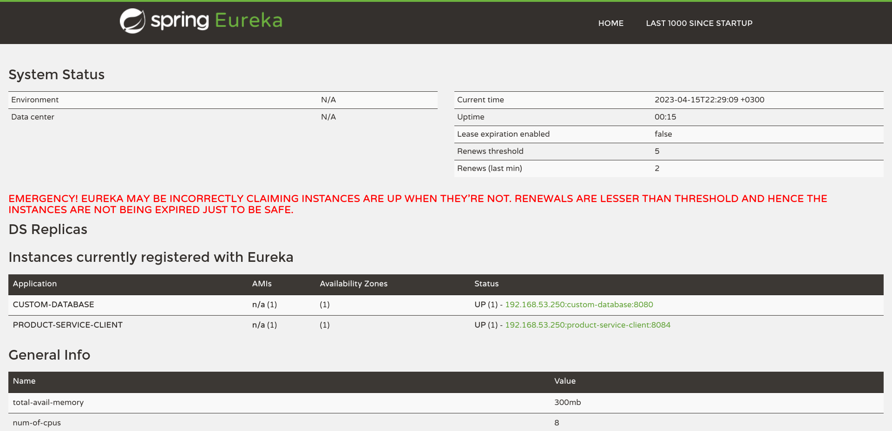

# my-distributed-database

Simple Spring Boot GraphQL distributed database based on [custom-database](https://github.com/pirosveta/custom-database)

## Tools

* Java 11+
* Spring Boot, Cloud, Eureka
* Maven (Tested on 3.8.1)
* Gradle (Tested on 7.4.2)
* GraphQL
* Lombok
* SnakeYaml
* Spring Boot DevTools

## How to run
* Run EurekaServer
```shell
$ gradle bootRun
```

* Run MainNode
```shell
$ mvn spring-boot:run
```

* Run Nodes
```shell
$ SERVER_PORT=8088 mvn spring-boot:run
$ SERVER_PORT=9092 mvn spring-boot:run
$ SERVER_PORT=7022 mvn spring-boot:run
$ ...
```

## Start with GUI

[http://localhost:8080/api/graphiql](http://localhost:8080/api/graphiql)



## Usage

```graphql
# Add user

mutation {
  createUser(
    request: { alias: "1", id: 1, name: "1 User", email: "1user@email.com" }
  ) {
    id
    name
    lastName
    email
  }
}
```

```graphql
# Get users

query {
  users(alias: "1") {
    id
    name
    lastName
    email
  }
}
```

```graphql
# Delete user

mutation {
  deleteUser(
    request: { alias: "1", id: 1 }
  ) {
    id
    name
    lastName
    email
  }
}

//TODO
```

### Transactions

To start a transaction, you need to send a request to start it, passing the transaction user as the `alias` parameter. At this moment, a temporary database is created -- a copy of the permanent database.

```graphql
mutation {
  begin(alias: "1") {
    message
  }
}
```

Next, you can start sending CRUD requests on behalf of the `alias` that was passed when the transaction began. During the transaction, the entire history of operations will be logged to the appropriate file. And the operations are performed in a temporary database. If the node falls, then, when it is restored, an attempt will be made to restore the log file as well. In this case, operations with records are already performed in a permanent database, and not in a temporary one.

To complete the transaction, you need to send a request to commit the changes made. When such a request is sent, changes from the temporary database are transferred to the permanent one, and the log file is cleared.

```graphql
mutation {
  commit(alias: "1") {
    message
  }
}
```

## Supported operations

See Supported operations.txt <br />
//TODO

## IDE Support

To use these projects in an IDE you will need the [project Lombok](http://projectlombok.org/features/index.html) agent. Full instructions can be found in the Lombok website. The sign that you need to do this is a lot of compiler errors to do with missing methods and fields.

## Access to Eureka Server

[http://localhost:7000/](http://localhost:7000/)



